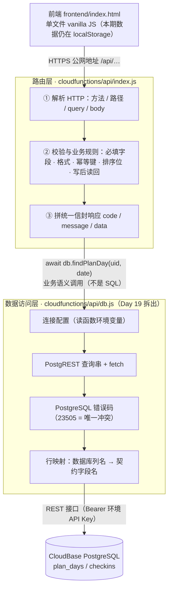

# 自律计划 · 技术设计文档（TECH_DESIGN.md）

- 版本：v2.1（Day 19：新增「二.1 分层结构」一节并重画项目结构树；v2.0 为重写版——由"纯前端单机路线"升级为"三方案比较 + 默认示范路线"）
- 撰写日期：2026-09-20（Day 5）
- 依据：`PRD.md` v2.0（自律计划）
- 版本历史：v1.0（同日早些时候）为纯前端 + localStorage 单机方案，已由 git 历史保留（提交 `133b7f5`），相当于任务清单里的"降级路线"；本版为完整版——多方案比较后给出默认路线
- 职责边界：定"怎么实现"，不写代码（代码 Day 7 起）

---

## 〇、待确认问题与临时假设

> 按要求先列问题；以下假设在确认前作为设计基线，任何一条被推翻只需改动对应章节。

| # | 待确认问题 | 临时假设（本文档采用） |
|---|-----------|----------------------|
| 1 | PRD 把"登录/多用户"列为本期不做，但后端 + 数据库通常需要用户身份，两者矛盾吗？ | **假设：使用 CloudBase 匿名登录**——用户无感知（无登录界面，符合 PRD A22"全程无登录"），云端自动生成并绑定设备级 `uid`；将来升级正式登录时数据可无缝继承 |
| 2 | 是否已有腾讯云 / CloudBase 账号与环境？ | **假设：第 3 周接入前开通**，使用免费基础版额度（个人学习足够） |
| 3 | 28 天时间预算是否仍是最硬约束？ | **假设：是**。因此采用分阶段策略：第 2 周纯前端本地跑通（零后端依赖），第 3 周再接云函数与数据库 |
| 4 | CloudBase 各产品（云函数/PostgreSQL/静态托管）的免费额度细节 | **假设：按官方文档公开说明为准，未逐一核实当前配额数字**，列在"不确定信息"待查 |

---

## 一、技术方案比较（三套）

### 方案 A：原生三件套 + localStorage + GitHub Pages（v1 路线 / 降级路线）

| 层 | 选型 |
|----|------|
| 前端 | 原生 HTML/CSS/JS，无框架 |
| 后端 | **无** |
| 数据库 | 浏览器 localStorage（约 5MB） |
| 部署 | GitHub Pages（或任意静态托管） |

- ✅ 零基础最快上手；无后端 = 无鉴权、无接口调试、无费用
- ✅ 数据天然在用户浏览器里，隐私零成本
- ❌ 换浏览器/换电脑数据不跟人走；清缓存即丢数据
- ❌ 无法生成"设备无关"的周/月报告；后续加登录/云同步基本要推倒重做存储层

### 方案 B（示范路线）：React/Vite + CloudBase 云函数 + CloudBase PostgreSQL + 静态托管

| 层 | 选型 |
|----|------|
| 前端 | React 18 + Vite（构建工具） |
| 后端 | CloudBase 云函数（Node.js） |
| 数据库 | CloudBase PostgreSQL（关系型，Serverless 化） |
| 部署 | CloudBase 静态网站托管 |

- ✅ **一体化**：函数、数据库、托管在同一个平台，一次开通全有，不用分别管服务器
- ✅ **课程对齐**：示范路线，遇卡点老师/同学有现成经验可问
- ✅ **演进顺畅**：PRD 列为"后续"的登录、云同步、多设备，都只是在现有架构上加东西，不是重写
- ✅ 国内访问速度好（腾讯云节点）
- ❌ React + SQL 对零基础是两座山，学习曲线陡
- ❌ 引入接口调试、数据库连不上的排查这类"看不见的问题"（第 2 天推 GitHub 时你已经体会过鉴权之痛，后端这类问题只多不少）

### 方案 C：Vue 3 + 自建 Node.js(Express) + 云 MySQL + 云服务器（传统自建）

| 层 | 选型 |
|----|------|
| 前端 | Vue 3 + Vite |
| 后端 | Node.js + Express（自己写服务器进程） |
| 数据库 | 云 MySQL（腾讯云/阿里云 RDS 或轻量服务器自装） |
| 部署 | 云服务器（nginx 反代 + 进程守护） |

- ✅ 概念最"正统"，学到的服务器知识可迁移
- ❌ 要自己管：服务器安全补丁、域名备案、HTTPS 证书、进程守护、数据库备份——每一项都是零基础的新坑
- ❌ 三家服务商/多组件拼装，出问题不知道怪谁
- ❌ 28 天内完成 MVP 的风险最高

### 推荐结论：**方案 B（示范路线）为默认路线**

| 取舍点 | 舍 | 得 |
|--------|----|----|
| 学习成本 | 放弃 A 的"无框架、全代码可读" | 换来组件化开发（时间轴/卡片/月历天然是三个组件）和课程支援 |
| 架构演进 | 放弃 A 的"零后端零运维" | 换来数据跟人走、报告跨设备一致、后续功能只加不改 |
| 控制力 | 放弃 C 的"一切自己掌控" | 换来平台托管运维，精力花在产品上 |
| 风险 | React+SQL 双学习曲线 | 用**分阶段策略**对冲：第 2 周前端先行（不碰后端），第 3 周再接云 |

> 与方案 A 不冲突的保留项：**localStorage 仍作为当日数据的本地缓存**（离线兜底，见"迁移注意事项"），但**唯一数据源（Source of Truth）是云端 PostgreSQL**。

---

## 二、项目结构

> **更新说明**：原计划是 React/Vite 多文件结构。考虑到 MVP 28 天节奏与零基础学员门槛，**改为 vanilla 单文件 HTML，按 5 步分步交付**。React/Vite 化作为 step 5 之后或后续的优化项（独立 TECH_DESIGN v3.0），不在本阶段范围。
> **Day 19 起**：第 3 周加了后端，云函数内部按「路由层 / 数据访问层」拆开（见下方 **二.1 分层结构**）。下方树已按**当前真实结构**重画。

```
habit-tracker/
├── frontend/
│   ├── index.html              ← 单文件 vanilla HTML：全部前端代码（约 2900 行）
│   └── assets/                 ← 6 张内置背景图
├── cloudfunctions/
│   └── api/                    ← 云函数「api」＝前端的唯一后端入口（Node.js 20，零 npm 依赖）
│       ├── index.js            ← 路由层：HTTP 解析 / 参数校验 / 业务规则 / 路由表
│       ├── db.js               ← 数据访问层：连接配置 / PostgREST 查询 / fetch / 行映射（Day 19 拆出）
│       ├── selftest.js         ← 本地自测：不联网、stub 掉 fetch（162 条断言）
│       └── package.json
├── db/                         ← 数据库脚本（在真库执行；本地无 Postgres 时用 pglite 先验）
│   ├── schema.sql              ← 建表（Day 16）
│   ├── schema-2.sql            ← 增量脚本：Day 18 起所有结构变更都追加在这里，不改 schema.sql
│   ├── seed.sql                ← 种子数据（编造的示例，可重复执行）
│   ├── verify.sql              ← 验证语句
│   └── README.md
├── skills/                     ← 项目内 Skill（提交进仓库，供老师 review）
├── docs/                       ← 早期素材（structure.svg 等）
├── research.md                 ← Day 3 调研
├── PRD.md / TECH_DESIGN.md     ← 需求文档 / 本文档
├── api-contract.md             ← 接口契约：第 3 周建表与写接口的唯一依据
├── RUN.md                      ← 怎么跑起来 / 怎么验证
└── DEPLOY.md                   ← 部署手册（云函数 + 数据库 + 静态托管）
```

**为什么放弃 React/Vite 路线（至少在 MVP 阶段）**：
1. **零基础友好**：无需 `npm install` / 构建工具链，打开页面就看到效果
2. **第 1 周节奏**：PRD v2.0 + TECH_DESIGN + 第 1 周任务清单加起来已经 3 份文档，**心智能耗已近上限**；引入 React 学习曲线会压垮新功能的学习
3. **数据模型没变**：所有 v2.0 的设计（4 张数据表、A1-A22 验收标准、3 主题 CSS 变量、规则拼装报告）都能在 vanilla 中实现
4. **未来切换成本可控**：当所有 F1-F5 跑通后，可一次性切到 React 而无需重写产品逻辑

> 前后端各自内部保持"三文件封顶"的精神不再适用（框架天生多文件），但**"存储只走一个模块"的铁律保留**：前端所有 localStorage 读写过 `loadData()/saveData()` 两个函数；后端所有数据库读写过 `db.js`（见下）。

### 二.1 分层结构（Day 19：云函数拆出数据访问层）

第 3 周的后端只有两个代码文件，各管一层，**依赖方向单向**：路由层 → 数据访问层 → 数据库。



**每层只知道自己该知道的事**（这是分层的全部意义）：

| 层 | 文件 | 知道什么 | **不**知道什么 |
|---|---|---|---|
| 路由层 | `cloudfunctions/api/index.js` | HTTP 怎么进怎么出、契约要什么形状、业务规则（校验 / 幂等 / 排序位 / 写后读回） | 数据库怎么连、表里有哪些列、查询串怎么写 |
| 数据访问层 | `cloudfunctions/api/db.js` | 怎么连数据库、表结构与列名、查询怎么写、错误码什么意思 | HTTP 长什么样、响应信封、业务规则 |
| 数据库 | CloudBase PostgreSQL | 数据本身 + 约束（唯一索引 / CHECK） | —— |

**这次重构具体搬了什么**（"查数据库的代码"从哪移到哪）：

| 搬走的代码 | 原来在哪 | 现在在哪 |
|---|---|---|
| 连接配置 `dbConfig()`（环境变量 → REST 基址） | index.js | **db.js** |
| `pgSelect` / `pgInsert`（拼查询串 + 调 fetch） | index.js | **db.js**，改名成更中性的 `select` / `insert` |
| 分页总数解析 `pickTotal` | index.js | **db.js** |
| 列清单 `CHECKIN_COLS` / `PLANDAY_COLS` | index.js | **db.js** |
| 行映射 `mapPlanDay` / `mapCheckin`（`done_at` → `doneAt`） | index.js | **db.js** |
| 散在各处的查询对象拼装（`uid: 'eq.…'`、`order: 'sort.asc'`） | index.js | **db.js** 的表级函数 `findPlanDay` / `listCheckinsByDay` / `listCheckins` / `existsCheckinWithReqId` / `findCheckinByReqId` / `findCheckinByContent` / `findLastSort` / `createCheckin` |

**搬家的好处**：以后要换数据库（改用 `pg` 驱动、换服务商、加一层缓存）只改 `db.js` 一个文件，路由层一行不用动；反过来加接口，也只在 `index.js` 加一条路由 + 调 `db.*`。
**接口路径与字段名一个都没动** —— 契约 `api-contract.md` 本次未作任何修改。

**怎么保证"搬完没搬坏"**：`cloudfunctions/api/selftest.js` 的断言从 140 条增至 **162 条**，新增的第 9 节专测分层 —— 既做**静态检查**（断言 `index.js` 里已不再出现 `fetch(`、REST 基址、数据库列名），也**直接调用 `db.js`** 证明它能脱离路由独立工作（这是"拆干净了"的真正证明）。

## 三、数据模型（CloudBase PostgreSQL）

```sql
-- 身份：匿名 uid 由 CloudBase 生成，不做登录 UI（临时假设 1）
CREATE TABLE users (
  uid        TEXT PRIMARY KEY,          -- CloudBase 匿名 uid
  name       TEXT NOT NULL DEFAULT '自律的你',
  theme      TEXT NOT NULL DEFAULT 'warm',   -- warm | night | matcha
  created_at TIMESTAMPTZ NOT NULL DEFAULT now()
);

CREATE TABLE todos (
  id         SERIAL PRIMARY KEY,
  uid        TEXT NOT NULL REFERENCES users(uid),
  date       DATE   NOT NULL,           -- 属于哪一天（本机自然日，PRD 裁定）
  text       TEXT   NOT NULL,
  time       TEXT,                      -- 'HH:MM'，可空 = 未安排
  done       BOOLEAN NOT NULL DEFAULT FALSE,
  done_at    TIMESTAMPTZ
);

CREATE TABLE moods (                    -- 一天一条，覆盖更新
  date       DATE   PRIMARY KEY,        -- MVP 单用户后 uid 维度第 4 周再拆
  uid        TEXT NOT NULL REFERENCES users(uid),
  mood       TEXT   NOT NULL CHECK (mood IN ('smile','calm','cry')),
  updated_at TIMESTAMPTZ NOT NULL DEFAULT now()
);

CREATE TABLE notes (
  id            SERIAL PRIMARY KEY,
  uid           TEXT NOT NULL REFERENCES users(uid),
  created_at    TIMESTAMPTZ NOT NULL DEFAULT now(),
  text          TEXT   NOT NULL,
  from_question BOOLEAN NOT NULL DEFAULT FALSE   -- 是否由每日一问引出
);

CREATE TABLE question_log (             -- 每日一问洗牌队列
  uid          TEXT NOT NULL,
  date         DATE   NOT NULL,
  question_idx INT    NOT NULL,         -- 题池索引
  swap_count   INT    NOT NULL DEFAULT 0,  -- "换一个"次数，上限 3
  PRIMARY KEY (uid, date)
);
```

> **统计一律现算不存**（PRD 原则）：完成数、连续天数、心情分布、报告由 `report` 接口用 SQL 聚合查询直接得出。

> **更新说明（Day 15，2026-10-01）**：上面的建表清单是 v2.0 时写的，只有 4 张表。Day 18–22 陆续加了**专注计时 / 纪念&倒数日 / 肯定语 / 主题换肤**四个板块，表清单已补全为 **7 张**（`users` / `plan_days` / `checkins` / `notes` / `focus_sessions` / `anniversaries` / `affirm_likes`），并在 `api-contract.md` §二 里给了每张表的字段来源与建表注意事项。
> **第 3 周建表以 `api-contract.md` 为准**（本文档本节作为背景保留，不再逐条同步）。

## 四、API 列表（云函数 `api` 统一承载，REST 风格）

| 方法 | 路径 | 作用 | 对应功能 |
|------|------|------|---------|
| GET | `/api/day?date=YYYY-MM-DD` | 一次取回该日待办 + 心情 + 当日问题（首屏合并请求，省往返） | F1/F2/F3 |
| POST | `/api/todos` | 新建待办 `{date, text, time?}` | F1 |
| PATCH | `/api/todos/:id` | 切换完成状态 / 改时间 | F1 |
| DELETE | `/api/todos/:id` | 删除待办 | F1 |
| PUT | `/api/moods` | 当日心情覆盖写入 `{date, mood}` | F2 |
| POST | `/api/notes` | 保存思考卡片 `{text, fromQuestion}` | F3 |
| GET | `/api/notes?from=&to=` | 卡片流（倒序分页） | F3 |
| POST | `/api/question/swap` | 换一题（服务端校验 ≤3 次） | F3 |
| GET | `/api/report?period=week\|month` | 统计 + 夸夸文案拼装 | F4 |
| GET | `/api/calendar?month=YYYY-MM` | 月历数据（每日心情 + 是否有记录） | F5 |
| GET / PUT | `/api/profile` | 读/改姓名与主题 | F5 |

> 所有接口从请求上下文取 `uid`（CloudBase SDK 注入），**不接受前端明传 uid**——防越权的第一道闸。

> **更新说明（Day 15，2026-10-01）**：本表是 v2.0 时的规划，只覆盖 F1–F5 五个功能。Day 18–22 新增的板块（专注计时 / 纪念&倒数日 / 肯定语 / 主题换肤）对应的接口，以及每条接口**完整的请求参数 / 响应 JSON 形状 / 错误返回**，统一写在 **`api-contract.md`** 里（共 22 个接口，含 6 个"列表读取"接口）。
> **第 3 周写接口以 `api-contract.md` 为唯一依据**。部署步骤见 `DEPLOY.md`。

## 五、前后端数据流

```
写入流（用户操作 → 云端）：
┌─────────┐ 点击/输入  ┌──────────────────┐  HTTPS+SDK鉴权  ┌───────────────┐
│ 用户操作 │ ────────→ │ React 组件        │ ─────────────→ │ CloudBase      │
└─────────┘           │ → store 更新本地态 │                 │ 云函数 api      │
                      │ → api/client.js   │                 │ → db.js 校验    │
                      │   发起请求          │                 │ → 写 PostgreSQL │
                      └──────────────────┘                 └───────┬───────┘
                      ↑ 响应回来后重新渲染                           │
                      └─────────────────────────────────────────────┘

读取流（页面打开 → 用户看到）：
App 加载 → GET /api/day（当日全量）→ 写入 store → 渲染三个视图
        ↘ 失败时 → 读 localStorage 缓存渲染（离线兜底）→ 顶部提示"离线模式，稍后同步"

数据流一句话：用户输入 → React 状态 → 云函数 → PostgreSQL（唯一真相源）；
              打开页面 → 云函数查库 → React 渲染；断网 → localStorage 缓存顶上。
```

三条铁律（从 v1 继承，全栈版表述）：
1. 前端请求只走 `api/client.js`，后端 SQL 只走 `db.js`——将来换托管/换库只改一个模块
2. 先更新数据、拿到响应、再渲染——不等响应就渲染 = 画面和数据库不一致的经典 bug
3. 统计现算不存（报告接口每次聚合查询）

## 六、错误处理

| 层 | 错误 | 处理策略 | 用户看到什么 |
|----|------|---------|-------------|
| 前端-网络 | 请求超时/断网 | 自动重试 1 次 → 降级 localStorage 缓存 + 待同步队列 | "离线模式"顶部条，不打断操作 |
| 前端-业务 | 输入为空、超长 | 提交前校验拦截 | 输入框红框 + 一行提示 |
| 云函数 | 参数缺失/非法 | 统一返回 `{code, message}`，code 表见下 | toast 一句话 |
| 云函数 | 数据库连接失败 | 返回 500 + 服务端日志记录 | "保存失败，已暂存本地，稍后自动同步" |
| 云函数-规则 | 给明天的待办打勾、换题超 3 次 | 服务端硬校验拒绝（前端禁用只是体验层） | 对应的明确拒绝提示 |
| 统一约定 | — | `code: 0` 成功；`4xx` 用户问题；`5xx` 服务端问题；所有 message 中文可直读 | — |

> 原则：**服务端是规则的最后防线**（PRD 的 A5"不能提前打勾"必须在服务端也拦住），前端校验只为体验。

## 七、环境变量

| 变量 | 放哪 | 作用 | 入库吗 |
|------|------|------|-------|
| `VITE_TCB_ENV_ID` | frontend/.env | CloudBase 环境 ID（前端 SDK 初始化用） | ❌ .gitignore 已拦截 ✅ |
| `PG_CONNECTION_STRING` | 云函数环境变量配置 | PostgreSQL 连接串（含密码） | ❌ 只存在云端控制台，**永远不进代码** |
| （模板） | frontend/.env.example | 只含变量名和示例占位值 | ✅ 入库，方便换机器时对照 |

> Day 2 埋的伏笔在这里兑现：`.gitignore` 里的 `.env` 规则当时就实测过——数据库密码类配置从第一天起就被挡在仓库外。云函数侧敏感配置一律走 CloudBase 控制台的环境变量功能，代码里零密钥。

## 八、迁移注意事项

| 场景 | 注意点 |
|------|--------|
| v1 设计（localStorage 单机）→ v2 云端 | 若第 2 周已产生本地数据：写一次性导入脚本（导出 JSON → POST 批量入库）；MVP 早期数据量小，宁可重录也不写复杂双向同步 |
| localStorage 的新角色 | 降级为**只读缓存 + 离线待同步队列**，不再是真相源；缓存 key 沿用 `zl.` 前缀 |
| 数据库结构变更 | `schema.sql` 进 git 版本化；改表一律"加列不删列"，删列等确认无引用后再做（零基础期最容易丢数据的地方） |
| 免费额度 | 接近 CloudBase 免费配额上限时的信号是请求变慢/报错，提前确认额度数字（见不确定信息） |
| 未来换部署（如迁出 CloudBase） | 因铁律 1（client.js / db.js 单出口）+ REST 接口标准形状，迁移成本 = 重写两个模块 + 导出 SQL |
| 匿名 uid → 正式登录 | CloudBase 支持匿名账号升级绑定，数据随 uid 迁移，前端无需变化（PRD"登录列后续"的技术兑现路径） |

## 九、不确定的信息（诚实标注）

| # | 信息 | 不确定点 |
|---|------|---------|
| 1 | CloudBase 免费版具体额度（云函数调用次数、数据库容量、托管流量） | 未在官方文档逐一核实当前数字，接入前（第 3 周）需确认 |
| 2 | CloudBase 匿名登录升级绑定正式账号的具体行为 | 官方能力存在，具体数据迁移行为未实测 |
| 3 | PostgreSQL CHECK 约束在 CloudBase Serverless PG 上的支持情况 | 标准 PG 能力，假定可用；建表时如报错则改为应用层校验 |
| 4 | React 18 + Vite 当前推荐版本号 | 以第 7 天 `npm create vite` 时的官方脚手架为准，本文档不锁死小版本 |

---

## 附：与课程资产的关系

- 数据流一句话（Day 5 要掌握的问题）的答案在本版变为：**数据从你的手指来，经 React 状态和云函数，落到云上的 PostgreSQL（唯一真相源）；打开页面时从云端取回渲染，断网时 localStorage 缓存顶上。**
- 第 2 周开工顺序：先 `frontend/`（React 本地跑通 F1 时间轴）→ 第 3 周开 CloudBase 环境 → 接云函数与数据库 → 第 4 周部署静态托管 + 验收 A1-A22
